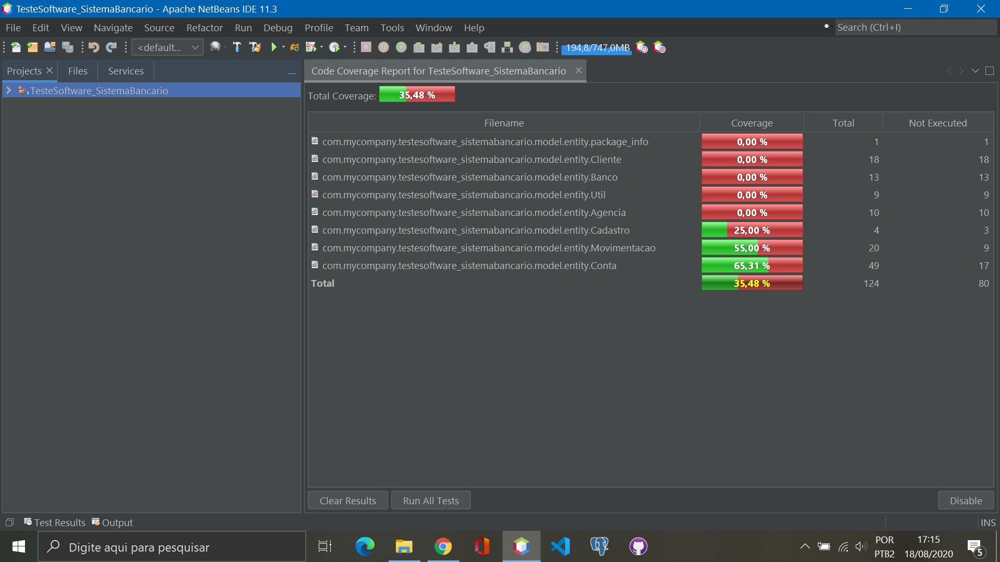
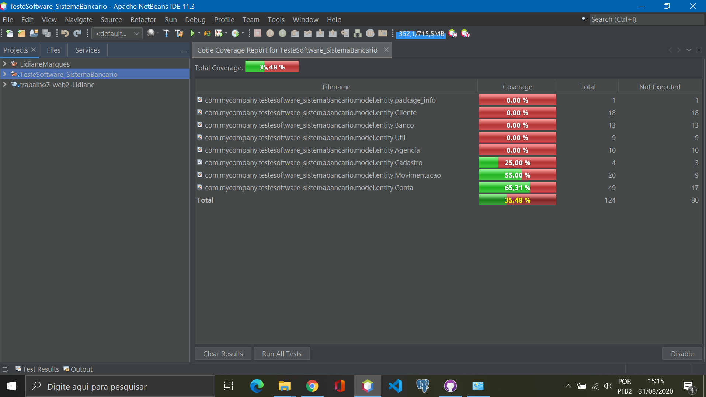

# TesteSoftware_SistemaBancario
Implementar os requisitos R01 a R04 para a classe Conta do vídeo #1 do Sistema Bancário

# INTEGRAÇÃO CONTÍNUA-CONTINUOUS INTEGRATION (CI)
Habilitar GitHub Actions no repositório do Sistema Bancário

# Cobertura de Código
Atualizar as configurações no pom.xml do Sistema Bancário para Cobertura de Código. Inclua um arquivo README.md na raiz do seu repositório contendo um print do relatório de cobertura de código atual do seu projeto.

# Cobertura de Código2
Com a implementação das classes: Agência, Banco, Cliente e Movimentações.

